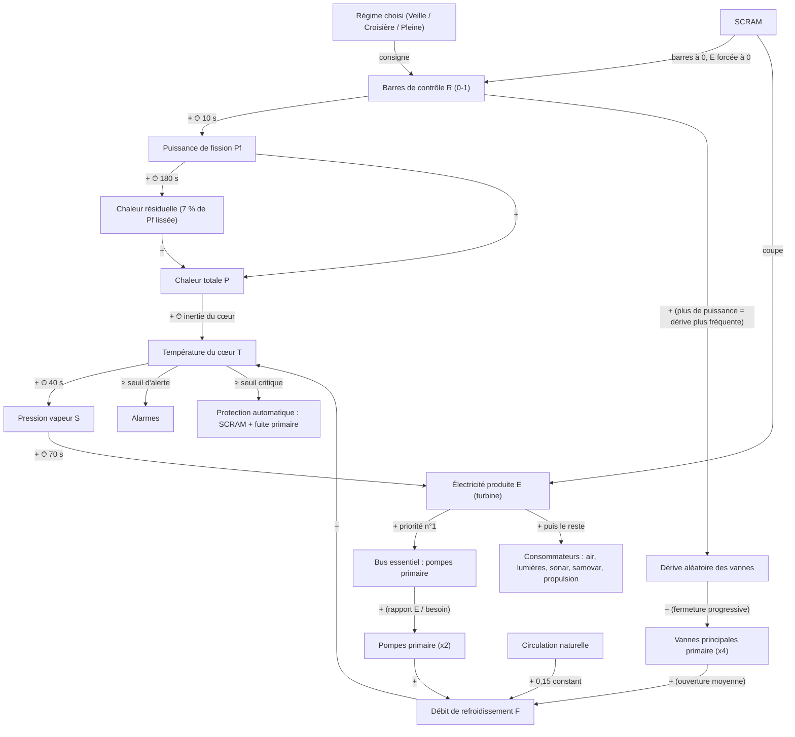

# Réacteur RK-1 « Petit Soleil » — arbre de dépendances (E3-01)

Issue : [#36](https://github.com/leo-brgn/SousTension/issues/36) · Alimente [#37](https://github.com/leo-brgn/SousTension/issues/37) (E3-02, modèle de simulation) · Source : GDD §3.3, §3.2, §1.4.

> **Statut : hypothèses de départ.** Toutes les constantes ci-dessous sont des valeurs initiales vérifiées sur un prototype jetable (`docs/design/reactor-prototype.js`). Elles seront ajustées en jouant (E3-02, puis les playtests). Ce qui compte pour la conception, ce sont la **structure** (qui dépend de quoi), le **signe** de chaque lien et les **ordres de grandeur des délais**.

## 1. Principes
1. **Chaîne longue et différée** (GDD §3.2) : toucher aux barres maintenant → problème de vapeur dans ~90 s → problème électrique dans ~2 à 3 min. Les joueurs apprennent à lire l'avenir du bateau.
2. **Jamais arbitraire** : chaque effet a une cause visible sur un instrument ; un nouveau joueur peut être utile sans comprendre la chaîne (3 régimes en façade, la complexité est découvrable, jamais requise).
3. **Le réacteur ne tue jamais vite** (règle de ton n°2) : la surchauffe déclenche des alarmes, puis une protection automatique et une fuite du circuit primaire ; jamais d'explosion.
4. **Déterministe** : pas fixe 0,1 s (10 Hz), aucun aléa hors générateur pseudo-aléatoire à graine. **Modèle côté serveur uniquement** (le réacteur est lent, le client n'a pas à le prédire : il affiche les jauges reçues).

## 2. Diagramme de dépendances

Légende : `+` = « plus de A → plus de B », `−` = « plus de A → moins de B », `⏱` = retard (constante de temps).



### La « boucle diabolique » (GDD §3.3), lue sur ce diagramme
Le refroidissement dépend de l'électricité, qui dépend de la vapeur, qui dépend de la chaleur du cœur :
**T → S → E → pompes → F → T**. Conséquences voulues :
- **À bas régime les pompes sont affamées** : en Veille la turbine ne couvre qu'environ 60 % du besoin des pompes ; à faible puissance cela suffit, mais **monter la puissance chauffe plus vite que l'électricité n'arrive** (la chaleur réagit en ~1 min, l'électricité en ~2 à 3 min) : une fenêtre de fragilité.
- **Après un SCRAM, plus d'électricité donc plus de pompes** : il ne reste que la circulation naturelle. Le cœur reste sûr, mais **redémarrer est une procédure à deux joueurs** (le bateau s'est assombri et coule doucement entre-temps).
- **L'amorçage est un jeu à part entière** : on ne peut pas refroidir sans électricité, ni produire d'électricité sans chauffer.

## 3. Variables d'état

| Symbole | Nom | Unité | Plage | Écrit par | Lu par |
|---|---|---|---|---|---|
| `R` | position des barres | 0–1 | 0–1 | régime (consigne), SCRAM | `Pf` |
| `Pf` | puissance de fission | MWth | 0–100 | barres | chaleur, jauges |
| `A` | puissance moyenne lissée (180 s) | MWth | 0–100 | `Pf` | chaleur résiduelle |
| `P` | chaleur totale | MWth | 0–110 | `Pf` + 7 % de `A` | cœur |
| `T` | température du cœur | °C | 280–~400 | chaleur, débit | vapeur, alarmes, jauges |
| `S` | pression vapeur | bar | 0–250 | `T` | turbine, jauges |
| `E` | électricité produite | MWe | 0–35 | `S` | bus, consommateurs, jauges |
| `eta` | couverture du bus essentiel | 0–1 | 0–1 | `E` / besoin des pompes | débit |
| `v₁..v₄` | ouverture des vannes principales | 0–1 | 0–1 | joueurs (rouvrir), dérive (fermer) | débit |
| `F` | débit de refroidissement | 0–~1,2 | 0–1,2 | pompes, vannes, circulation naturelle | température |
| `scram` | arrêt d'urgence actif | booléen | — | joueurs | tout |

## 4. Équations (pas `dt` = 0,1 s, Euler explicite)

```
cible_barres   = scram ? 0 : R_régime              R_régime : Veille 0,10 · Croisière 0,45 · Pleine 0,90
R             += clamp(cible_barres − R, ±vitesse_barres·dt)     vitesse : 0,02 /s (SCRAM : ×20)
Pf            += (100·R − Pf)·dt / τP                              τP = 10 s
A             += (Pf − A)·dt / τdécroissance                       τdécroissance = 180 s
P              = Pf + 0,07·A
besoin_pompes  = nb_pompes_marche · 4 MWe
E             += ((scram ? 0 : 0,13·S) − E)·dt / τE                τE = 70 s
eta            = besoin_pompes > 0 ? min(1, E / besoin_pompes) : 0
F              = nb_pompes_marche·0,5·eta·moyenne(v₁..v₄) + 0,15    (0,15 = circulation naturelle)
T             += (P − 1,3·F·(T − 280)) / 160 · dt                  1,3 MW/°C par unité de débit · inertie 160 MJ/°C
S             += (max(0, (T − 280)·100/30) − S)·dt / τS            τS = 40 s
```

### Dérive du refroidissement (« surveillance active »)
Un générateur pseudo-aléatoire à graine ferme au hasard une vanne de 0,05 à 0,15 à intervalles aléatoires :
`prochain_délai = 6,5 s / max(0,01, R²) × U(0,5 ; 1,5)` (première dérive à 30 s).
→ à pleine puissance (`R` = 0,9) une dérive toutes les ~8 s ; en croisière (0,45) toutes les ~32 s ; en veille presque jamais. **Le joueur doit rouvrir les vannes** (action physique au tableau, voir E3-06) ; sans surveillance la température monte jusqu'à la protection automatique.

## 5. Régimes (GDD §3.3) : ce qui est attendu et vérifié sur le prototype

| Régime | Barres `R` | Produit | Bruit | Risque | Vérifié (prototype, `valves` = 1) |
|---|---|---|---|---|---|
| **Veille** | 0,10 | minimum vital | ○ | l'air et la lumière déclinent lentement | stable, `T` ≈ 291 °C, `E` ≈ 4,8 MWe (couverture des pompes ≈ 60 %) |
| **Croisière** | 0,45 | confortable | ●● | dérives lentes, gérable | stable, `T` ≈ 312 °C ; sans surveillance 10 min : ≈ 329 °C (proche de l'alerte) |
| **Pleine puissance** | 0,90 | tout, vite | ●●●● | **surchauffe en ~4 min sans surveillance active** | avertissement à 165–187 s, **seuil critique à 237–275 s** (6 graines) |

Seuils : **alerte 350 °C**, **critique 370 °C**. À pleine puissance, vannes toutes ouvertes, `T` se stabilise vers 345 °C : tenable par un bon opérateur, mais sans marge.

### Délais vérifiés (échelon Croisière → Pleine, sans dérive)
| Effet | Mesure |
|---|---|
| `T` +5 °C | 48 s |
| `S` +25 % (« problème de vapeur », cible GDD ~90 s) | **101 s** |
| `E` +25 % (« problème électrique », cible GDD ~3 min) | **140 s** |

### SCRAM
`E` tombe à 0 (la turbine s'arrête, les pompes aussi) ; les barres descendent 20× plus vite ; il ne reste que la circulation naturelle. Depuis la pleine puissance, `T` **ne dépasse pas 340 °C** sur 30 min : le SCRAM **sauve le réacteur** (GDD) ; le coût est le noir total et le redémarrage à deux joueurs.

## 6. Pannes et conséquences (lien avec les alarmes, E3-09)

| Condition | Conséquence | Alarme (à produire, E3-09) |
|---|---|---|
| `T` ≥ 350 °C | alerte | température cœur haute |
| `T` ≥ 370 °C (> 30 s) | **protection automatique** : SCRAM + **fuite du circuit primaire** → zone chaude (E7-01) | surchauffe / fuite primaire |
| débit `F` < 0,6 | refroidissement insuffisant | débit bas |
| `eta` < 1 | pompes affamées | bus essentiel sous-alimenté |
| `E` < besoin total | délestage : air et lumières déclinent | tension basse |
| vannes < 0,5 en moyenne | dérive accumulée | vanne fermée à rouvrir |

Aucune de ces conséquences n'est létale (règle de ton n°2) : au pire, fuite primaire → radiation → contamination (E7), puis évanouissement théâtral.

## 7. Ce que E3-02 doit livrer (critères d'acceptation)
1. À pleine puissance sans intervention, surchauffe (≥ critique) en 4 min ± 40 s.
2. Veille stable ; l'air et la lumière déclinent lentement.
3. SCRAM : coupe l'électricité immédiatement ; le cœur reste sûr.
4. La boucle diabolique est observable (pompes affamées à bas régime, électricité en retard sur la chaleur).
5. Déterminisme : mêmes entrées et même graine → même état au tick N.

## 8. Questions ouvertes (à trancher pendant E3-02 / playtests)
- Les **consommateurs** (air, lumières, sonar, samovar, propulsion) et leurs besoins en MWe ne sont pas encore définis : E3-07 (réseau électrique).
- La **propulsion** consomme-t-elle directement sur l'électricité ou sur une part de la vapeur ? (GDD : « électricité + propulsion ».)
- L'**effet d'une pompe en panne** (état « cassé ») et le rôle exact des **4 vannes** (une par boucle ? interactions entre vannes ?) sont à préciser avec E3-06.
- Les **batteries de secours** pour l'amorçage après SCRAM (E3-07) : durée d'autonomie et rôle dans la procédure de redémarrage à deux joueurs (E3-05).
- **Équilibrage** : tous les chiffres de ce document.
